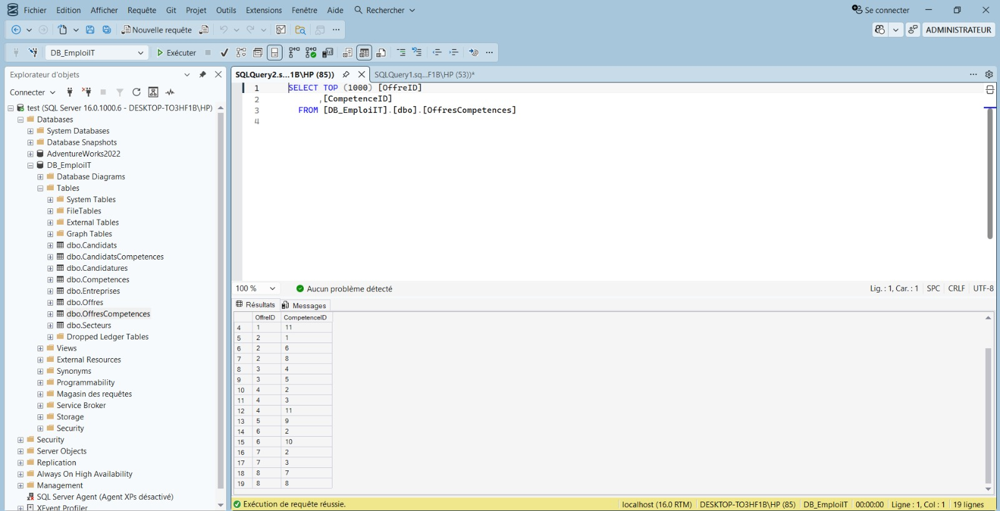
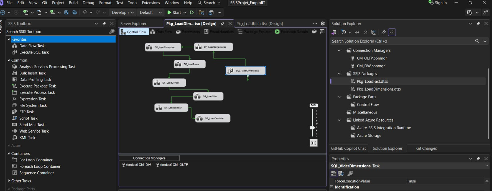
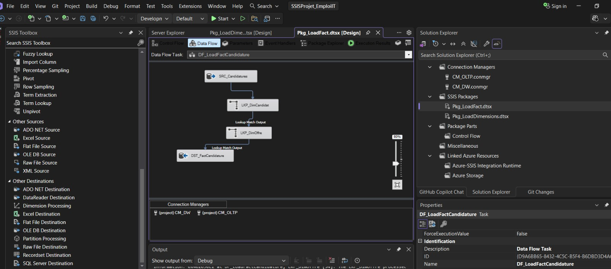
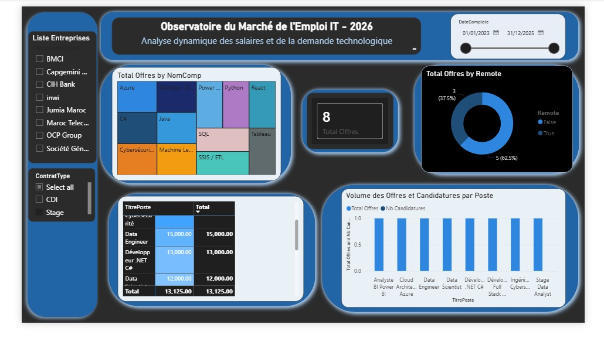
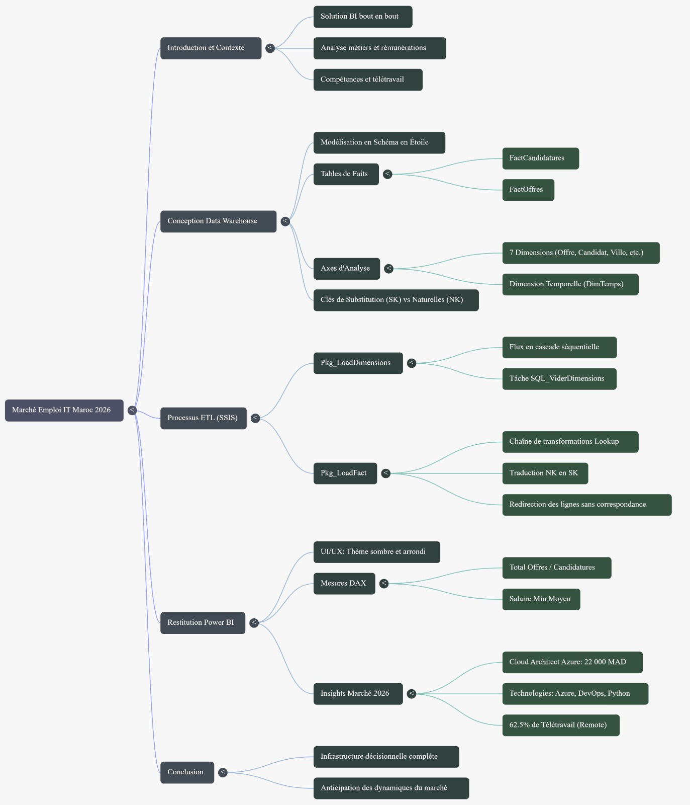
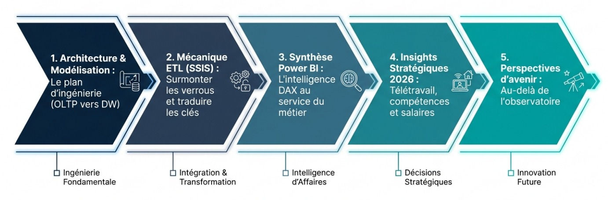

# Observatoire du Marché de l'Emploi IT — Maroc 2026

<div align="center">


**Intelligence Décisionnelle · ENSA Berrechid · 2025-2026**

*Solution BI bout-en-bout : OLTP → ETL (SSIS) → Data Warehouse → Power BI*

</div>

---

## Table des matières

1. [Contexte & Objectifs](#-contexte--objectifs)
2. [Architecture Globale](#-architecture-globale)
3. [Stack Technologique](#-stack-technologique)
4. [Structure du Projet](#-structure-du-projet)
5. [Phase 1 — Base de données OLTP](#-phase-1--base-de-données-oltp-db_emploiit)
6. [Phase 2 — Data Warehouse (Schéma en Étoile)](#-phase-2--data-warehouse-dw_emploiit)
7. [Phase 3 — Pipeline ETL (SSIS)](#-phase-3--pipeline-etl-ssis)
8. [Phase 4 — Tableau de bord Power BI](#-phase-4--tableau-de-bord-power-bi)
9. [Insights Clés](#-insights-clés-du-marché-it-maroc-2026)

---

## Contexte & Objectifs

Le marché de l'emploi IT au Maroc connaît une transformation accélérée en 2026.
Ce projet construit une **infrastructure décisionnelle complète** permettant d'analyser :

- Les **offres d'emploi** publiées par secteur, ville et type de contrat
- Les **profils candidats** et leur niveau de compétence
- Le **matching compétences** entre offres et candidats
- Les **fourchettes salariales** par poste et par expérience
- Les **tendances temporelles** du marché IT

> **Périmètre** : 8 entreprises marocaines réelles (CIH Bank, Maroc Telecom, OCP Group, Capgemini, Jumia…),
> 8 offres d'emploi, 7 candidats, 12 compétences IT.

---

## Architecture Globale

```
┌─────────────────────────────────────────────────────────────────────┐
│  Zone 1 : Production    Zone 2 : Transformation   Zone 3 : Stockage │
│  (Source)               (Moteur ETL)              (Fondation DW)    │
│                                                                     │
│  DB_EmploiIT      ──►  SSIS / Visual Studio  ──►  DW_EmploiIT       │
│  (SQL Server)           Extraction, nettoyage      Schéma en étoile │
│  OLTP normalisé         TRUNCATE/DBCC              Clés SK          │
│  Clés naturelles        Traduction NK → SK         Mode import      │
│                                                          │          │
│                                            Zone 4 : Restitution     │
│                                            (L'Exécutif)             │
│                                            Power BI Desktop         │
│                                            Tableau de bord DAX      │
└─────────────────────────────────────────────────────────────────────┘
```


---

## Stack Technologique

| Couche | Technologie | Rôle |
|--------|-------------|------|
| **Source OLTP** | Microsoft SQL Server 2022 | Base transactionnelle normalisée |
| **ETL** | SSIS (SQL Server Integration Services) | Extraction, transformation, chargement |
| **IDE ETL** | Visual Studio 2022 + SSDT | Développement des packages `.dtsx` |
| **DW** | Microsoft SQL Server 2022 | Entrepôt de données — schéma en étoile |
| **Visualisation** | Power BI Desktop | Tableau de bord interactif |
| **Moteur DAX** | Power BI VertiPaq | Mesures et calculs analytiques |

---

## Structure du Projet

```
EmploiIT_BI/
│
├── 01_OLTP_Database/
│   └── P13_EmploiIT_OLTP.sql         ← Création + données DB_EmploiIT
│
├── 02_DataWarehouse/
│   ├── DW_EmploiIT_Create.sql        ← Schéma en étoile DW_EmploiIT
│   └── DW_EmploiIT_Load.sql          ← Chargement T-SQL (équivalent SSIS)
│
├── 03_SSIS_ETL/
│   └── SSIS_Architecture.md          ← Documentation packages SSIS
│
└── 04_PowerBI/
    └── Mesures_DAX.dax               ← Formules DAX du tableau de bord
```

---

## Phase 1 — Base de données OLTP (`DB_EmploiIT`)

### Modèle relationnel

La base transactionnelle contient **7 tables normalisées** avec des clés naturelles (NK) :

```sql
Secteurs ──< Entreprises ──< Offres ──< OffresCompetences >── Competences
                                  ╰──< Candidatures >── Candidats ──< CandidatsCompetences
```

### Tables principales

| Table | Colonnes clés | Description |
|-------|---------------|-------------|
| `Secteurs` | SecteurID, NomSecteur | 7 secteurs (Banque, Télécom, E-Commerce…) |
| `Entreprises` | EntrepriseID, NomEntreprise, Taille | 8 entreprises marocaines |
| `Competences` | CompetenceID, NomComp, Categorie | 12 compétences IT (Python, SQL, Azure…) |
| `Offres` | OffreID, TitrePoste, ContratType, SalaireMin/Max | 8 offres actives |
| `OffresCompetences` | OffreID, CompetenceID | Table de liaison N:M |
| `Candidats` | CandidatID, NiveauFormation, AnneeExp | 7 candidats profilés |
| `CandidatsCompetences` | CandidatID, CompetenceID, Niveau | Niveaux : Débutant → Expert |
| `Candidatures` | CandidatureID, Statut, DateEntretien | 11 candidatures (Reçue/Entretien/Embauchée/Rejetée) |

### Données de référence

**Entreprises :** CIH Bank · Maroc Telecom · Jumia Maroc · OCP Group · Capgemini Maroc · BMCI · inwi · Société Générale Maroc

**Compétences IT :** Python · SQL · Power BI · Java · React · Machine Learning · DevOps/Docker · Azure · Cybersécurité · C# · SSIS/ETL · Tableau

### Capture SSMS — DB_EmploiIT



---

## Phase 2 — Data Warehouse (`DW_EmploiIT`)

### Schéma en étoile (Star Schema)

Le DW adopte une modélisation **schéma en étoile** avec **2 tables de faits** et **7 dimensions** :

```
                    DimCompetence
                         │ 1
                         │
DimCandidat ──*── FactCandidatures ──*── DimOffre ──1── DimEntreprise
                         │                   │
                         │ *                 │ *
                      DimTemps          FactOffres ──*── DimCompetence
                                             │
                                          DimTemps
```

### Tables de faits

#### `FactOffres` — Analyse des offres publiées
| Colonne | Type | Description |
|---------|------|-------------|
| FactOffreSK | INT (PK) | Clé de substitution |
| OffreSK | INT (FK) | → DimOffre |
| EntrepriseSK | INT (FK) | → DimEntreprise |
| CompetenceSK | INT (FK) | → DimCompetence |
| DatePublicationSK | INT (FK) | → DimTemps |
| SalaireMin / SalaireMax | DECIMAL | Fourchette salariale |
| NbCandidatures | INT | Nombre de candidatures reçues |
| DureeOffre_Jours | INT | Durée de validité de l'offre |

#### `FactCandidatures` — Analyse des candidatures
| Colonne | Type | Description |
|---------|------|-------------|
| FactCandidatureSK | INT (PK) | Clé de substitution |
| CandidatSK | INT (FK) | → DimCandidat |
| OffreSK | INT (FK) | → DimOffre |
| DateCandidatureSK | INT (FK) | → DimTemps |
| EstEmbauche | BIT | 1 = Embauchée |
| DelaiEntretien_Jours | INT | Délai entre candidature et entretien |
| NbCompetencesMatch | INT | Compétences candidate ∩ offre |

### Schéma en étoile — Conception


### Modèle Power BI — Vue relations


---

## Phase 3 — Pipeline ETL (SSIS)

### Vue d'ensemble

Le pipeline ETL est constitué de **2 packages SSIS** développés sous Visual Studio 2022 :

```
SSISProjet_EmploiIT/
├── Pkg_LoadDimensions.dtsx   ← Chargement ordonné des 7 dimensions
└── Pkg_LoadFact.dtsx         ← Chargement des 2 tables de faits
```

### Package 1 : `Pkg_LoadDimensions.dtsx`

**Flux de contrôle :** Exécution séquentielle avec contraintes de précédence.

1. `SQL_ViderDimensions` — Purge les tables dans le bon ordre (FK)
2. `DF_LoadCompetence` → `DF_LoadEntreprise` → `DF_LoadCandidat`
3. `DF_LoadPoste` → `DF_LoadContrat` → `DF_LoadVille` → `DF_LoadSecteur`




### Package 2 : `Pkg_LoadFact.dtsx`

**Flux de données `DF_LoadFactOffres` :**

```
OLE DB Source (Offres JOIN OffresCompetences)
    └──► Lookup (DimEntreprise) ──► Lookup (DimOffre) ──► Lookup (DimCompetence)
              └──► Lookup (DimTemps pub.) ──► Lookup (DimTemps exp.)
                        └──► Union All ──► OLE DB Destination (FactOffres)
```

**Flux de données `DF_LoadFactCandidature` :**

```
SRC_Candidatures
    └──► LKP_DimCandidat ──► LKP_DimOffre ──► Lookups Dates
              └──► Union All ──► DST_FactCandidature
```




### Mécanisme Lookup : Traduction NK → SK

Le mécanisme central du pipeline : conversion des clés naturelles OLTP en clés de substitution DW.


### Moteur VertiPaq (Power BI)


### Flux FactOffres — Lookups multiples


### Flux FactCandidatures — Lookups


---

## Phase 4 — Tableau de bord Power BI

### Architecture du rapport

Le tableau de bord **"Observatoire du Marché IT Maroc 2026"** est structuré en **3 pages** :

| Page | Contenu |
|------|---------|
| **Offres & Compétences** | Treemap des compétences, répartition contrats, offres par ville |
| **Candidats & Matching** | Taux d'embauche par formation, matching compétences, statuts |
| **Offres & Salaires** | Salaire moyen par poste, volume offres vs candidatures |

### Mesures DAX principales

```dax
-- Nombre d'offres distinctes
NbOffres = DISTINCTCOUNT(FactOffres[OffreID_NK])

-- Taux d'embauche global
TauxEmbauche =
    DIVIDE(
        COUNTROWS(FILTER(FactCandidatures, FactCandidatures[EstEmbauche] = 1)),
        COUNTROWS(FactCandidatures),
        0
    )

-- Salaire moyen (midpoint)
SalMoy =
    DIVIDE(
        SUMX(
            SUMMARIZE(FactOffres, FactOffres[OffreID_NK], "Min", MIN(...), "Max", MAX(...)),
            ([Min] + [Max]) / 2
        ),
        DISTINCTCOUNT(FactOffres[OffreID_NK])
    )
```

### Tableau de bord — Vue principale


### Observatoire du Marché IT — Thème sombre



### Tableau de bord — Vue détaillée


---

## Insights Clés du Marché IT Maroc 2026

| Indicateur | Valeur |
|------------|--------|
| Offres publiées | **8** (CDI majoritaires) |
| Candidatures totales | **11** |
| Taux d'embauche | **33,33 %** |
| Salaire moyen | **~16 380 MAD/mois** |
| Taux de télétravail | **37,5 %** (3/8 offres) |
| Poste le mieux rémunéré | **Cloud Architect Azure** (22k–35k MAD) |

### Compétences les plus demandées

```
SQL           ████████████████████  #1
Azure         ██████████████████    #2
Power BI      ████████████████      #3
Python        ██████████████        #4
SSIS/ETL      ████████████          #5
```

### Mind Map du projet



### Roadmap 5 phases



---

<!-- ## Lancer le projet

### Prérequis

- Microsoft SQL Server 2022 (ou 2019+)
- SQL Server Management Studio (SSMS)
- Visual Studio 2022 + SSIS Extension (SSDT)
- Power BI Desktop (dernière version)

### Étapes d'exécution

#### 1. Créer la base OLTP

```bash
# Dans SSMS, ouvrir et exécuter :
01_OLTP_Database/P13_EmploiIT_OLTP.sql
```

#### 2. Créer le Data Warehouse

```bash
# Dans SSMS, ouvrir et exécuter :
02_DataWarehouse/DW_EmploiIT_Create.sql
```

#### 3a. Chargement via T-SQL (sans SSIS)

```bash
# Dans SSMS, ouvrir et exécuter :
02_DataWarehouse/DW_EmploiIT_Load.sql
```

#### 3b. Chargement via SSIS (avec Visual Studio)

```
1. Ouvrir SSISProjet_EmploiIT.sln dans Visual Studio 2022
2. Configurer les Connection Managers :
   - CM_OLTP → votre instance SQL Server → DB_EmploiIT
   - CM_DW   → votre instance SQL Server → DW_EmploiIT
3. Exécuter Pkg_LoadDimensions.dtsx
4. Exécuter Pkg_LoadFact.dtsx
```

#### 4. Ouvrir le tableau de bord Power BI

```
1. Ouvrir le fichier .pbix dans 04_PowerBI/
2. Dans Power BI Desktop → Transformer les données
3. Mettre à jour la chaîne de connexion SQL Server
4. Actualiser les données
```

--- -->

## 

[](https://github.com/zakariaennaqui)
[](https://www.linkedin.com/in/zakaria-ennaqui-990883362)
[](https://zakaria-ennaqui.vercel.app)

---

<div align="center">

*Projet réalisé dans le cadre du module **Informatique Décisionnelle** — ENSA Berrechid · 2025-2026*

</div>
